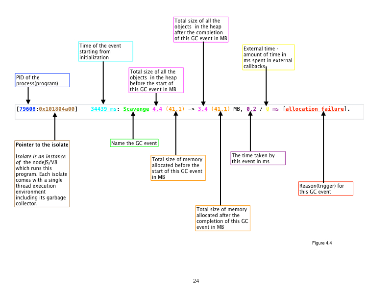

# gc-trace-parser-csv

A command line utility to parse and convert captured gc traces to CSV format for further analysis.


[](https://travis-ci.org/jwadhwani/gc-trace-parser-csv)
[](https://coveralls.io/github/jwadhwani/gc-trace-parser-csv)

## Background

I use gc traces to check for memory leaks and performance issues. Converting these logs to csv allows me to plot graphs to show trends in terms of memory usage and gc time.


## Installation

```bash
$ npm install -g gc-trace-parser-csv
```


## Usage:
```bash
gc-trace-parser-csv -i [input log file] -o [output csv file]
```

## Typical usage:

#### Capture:
```bash
node -trace_gc ./examples/example-1-simple-loop.js > ./examples/example-1-simple-loop.log
```

#### Parse and convert to CSV:
```bash
gc-trace-parser-csv -i ./examples/example-1-simple-loop.log -o ./examples/example-1-simple-loop.csv
```

## A breakdown of a typical trace:



For more information on traces please refer to my post [Does my NodeJS application leak memory? – 4](https://phptouch.com/2016/06/07/does-my-nodejs-application-leak-memory-4/)

## Examples

There are two examples in the examples directory with their associated log and csv files. 
__A simple loop__

Example: _example-1-simple-loop.js_:

```js
"use strict";

var s = [];

//stores 1,000,000 in a local variable
function aString(){
    var text = '';

    //empty out the array when it contains 100, 1,000,000 size char strings
    if(s.length === 100){
        s = [];//this should signal a gc
    }

    //1,000,000 chars added
    for(var i = 0; i < 10000; i++){

        //string of 100 characters
        text += 'Lorem Ipsum is simply dummy text of the printing and typesetting industry. Lorem Ipsum has been the ';
    }
    s.push(text);

}

//loop pushing strings of 1,000,000 bytes each time
for(var i = 0; i < 50000; i++ ){
    aString();
}
```

#### Capture output of example-1-simple-loop.js to a log file:
```bash
node -trace_gc ./examples/example-1-simple-loop.js > ./examples/example-1-simple-loop.log
```

#### Parse and convert example-1-simple-loop.log to CSV:
```bash
gc-trace-parser-csv -i ./examples/example-1-simple-loop.log -o ./example-1-simple-loop.csv
```

#### Create and analyze plot of example-1-simple-loop.csv

You can view the chart in [Plotly](https://plot.ly/~jwadhwani/4/example-1-simple-loop/). Plotly is one of the simplest charting tools I have seen.

__Closure__

Example: _example-2-closure.js_:

```js
"use strict";

function bString(){
    var s = []; //withing a closure

//stores 1,000,000 in a local variable
    return function aString(){
        var text = '';

        //empty out the array when it contains 400 1,000,000 char strings
        if(s.length === 100){
            s = [];
        }

        //1,000,000 chars added
        for(var i = 0; i < 10000; i++){

            //string of 100 characters
            text += 'Lorem Ipsum is simply dummy text of the printing and typesetting industry. Lorem Ipsum has been the ';
        }
        s.push(text);

    }
}


var aStr = bString();

for(var i = 0; i < 50000; i++ ){
    aStr();
}
```

#### Capture output of example-2-closure.js to a log file:
```bash
node -trace_gc ./examples/example-2-closure.js > ./examples/example-2-closure.log
```

#### Parse and convert example-2-closure.log to CSV:
```bash
gc-trace-parser-csv -i ./examples/example-2-closure.log -o ./examples/example-2-closure.csv
```

#### create and analyze plot

You can view the chart in [Plotly](https://plot.ly/~jwadhwani/7/example-2-closure/)


## Creating your own command line utility

You could use the parser in your app or code like any other module

```js
"use strict";
const parser = require('trace-parser-csv');

const f = 'path/to/your-trace-log-file.log';
parser(f, function (err, res) {
    if(err) throw err;
    
    //res contains the csv data
});


```

## Testing

```bash
$ npm test
```

## Compiling to ES5

```bash
$ npm run compile
```

## Author

 - Jayesh Wadhwani

## License

(The MIT License)

Copyright (c) 2016 Jayesh Wadhwani

Permission is hereby granted, free of charge, to any person obtaining
a copy of this software and associated documentation files (the
'Software'), to deal in the Software without restriction, including
without limitation the rights to use, copy, modify, merge, publish,
distribute, sublicense, and/or sell copies of the Software, and to
permit persons to whom the Software is furnished to do so, subject to
the following conditions:

The above copyright notice and this permission notice shall be
included in all copies or substantial portions of the Software.

THE SOFTWARE IS PROVIDED 'AS IS', WITHOUT WARRANTY OF ANY KIND,
EXPRESS OR IMPLIED, INCLUDING BUT NOT LIMITED TO THE WARRANTIES OF
MERCHANTABILITY, FITNESS FOR A PARTICULAR PURPOSE AND NONINFRINGEMENT.
IN NO EVENT SHALL THE AUTHORS OR COPYRIGHT HOLDERS BE LIABLE FOR ANY
CLAIM, DAMAGES OR OTHER LIABILITY, WHETHER IN AN ACTION OF CONTRACT,
TORT OR OTHERWISE, ARISING FROM, OUT OF OR IN CONNECTION WITH THE
SOFTWARE OR THE USE OR OTHER DEALINGS IN THE SOFTWARE.